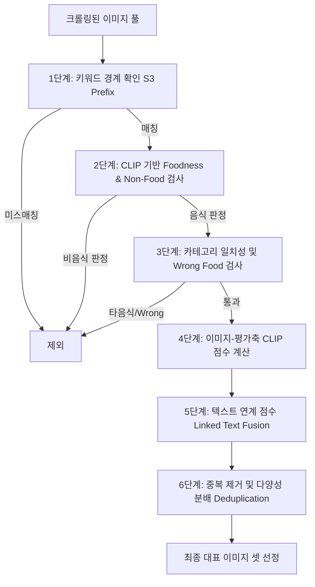

# 이미지 및 평가축 선정 알고리즘 설명서 (Image & Axis Selection Guide)

본 설명서는 프로젝트 내에서 맛집 리뷰 데이터 분석 및 다차원 맛 프로파일링을 수행하기 위해 구축된 **평가축(Axes)** 및 **대표 이미지(Representative Images)**의 선정 원리, 규칙, 그리고 알고리즘에 대해 상세히 설명합니다.

---

## 1. 평가축 (Axes) 선정 원리 및 구조

평가축은 식당의 개별 특성을 다차원(Multi-dimensional) 공간에 매핑하기 위한 기준선입니다. 본 프로젝트는 모든 음식에 일괄적인 기준을 적용하는 대신, **공통 맛/식감 축**과 **음식 카테고리별 특화 축**을 결합하는 동적 설계 방식을 취하고 있습니다.

### 1) 평가축의 분류 (`stand_axes.json`)
*   **공통 맛/식감 축 (Shared Taste Axes)**
    *   모든 음식에 범용적으로 존재할 수 있는 미각 및 촉각의 차원입니다.
    *   *종류:* `짠맛`, `단맛`, `매운맛`, `감칠맛`, `고소함`, `담백함` (맛) / `바삭함`, `촉촉함`, `쫄깃함`, `느끼함` (식감) / `온도감` (기타).
*   **음식 카테고리별 특화 축 (Food Specific Axes)**
    *   특정 음식 카테고리에서 소비자가 유의미하게 평가하는 핵심 요소를 반영합니다.
    *   *예시:*
        *   **버거:** `패티 품질`, `빵 식감`, `야채 신선도`, `소스 조화`
        *   **치킨:** `크기`, `양념 조화`, `튀김 바삭함`, `육즙·염지`, `사이드 구성`
        *   **짜장:** `면 컨디션`, `불맛·웍향`, `소스 농도`, `재료 퀄리티`
        *   **커피:** `산미`, `바디감`, `로스팅 정도`, `향미`, `크레마`, `쓴맛 균형`
*   **메타 축 (Meta Axes)**
    *   맛 외적인 만족도 요소를 나타내며, 추천 점수 계산 시 보조적인 가중치로 활용됩니다.
    *   *종류:* `전반적 만족`, `양 많음`, `가성비`, `재주문 의사`.

### 2) 카테고리별 평가축 필터링 정책 (Axis Policy)
각 음식 검색어(Keyword)에 대해 레이더 차트의 가독성을 높이고 무의미한 노이즈 데이터를 줄이기 위해 **필터링 정책**을 적용합니다.
*   `include_shared_taste_axes = false` 인 경우, 전체 공통 축 중 해당 음식에 핵심적인 공통 축만 `shared_taste_allowlist`를 통해 제한적으로 허용합니다.
    *   *마라탕 예시:* 공통 축 중 `매운맛`, `감칠맛`, `고소함`만 허용하고 `단맛`, `신맛` 등 무관한 축은 배제한 뒤, 마라탕 특화 축을 붙여서 총 평가축을 구성합니다.
*   이를 통해 각 음식에 가장 최적화된 다각형 차트(Radar Chart)를 렌더링하고, 불필요한 속성 계산을 생략하여 분석 효율성을 증대시킵니다.

---

## 2. 대표 이미지 (Representative Images) 선정 알고리즘

식당 상세 페이지 등에서 각 평가축의 매칭 점수를 대표하여 시각화해 줄 이미지를 선정하는 과정입니다. 네이버 플레이스 크롤링을 통해 수집된 다수의 이미지 중, **신뢰도가 높고 평가축을 가장 잘 묘사하는 정수(精髓) 이미지**를 고르기 위해 다단계 멀티모달(CLIP + Text) 필터 및 알고리즘을 사용합니다.

### 1) 1단계: 키워드 경계 확인 (S3 URL Prefix Verification)
*   리뷰 이미지의 S3 업로드 경로인 `/reviews/<keyword>/`를 검사합니다.
*   식당 간 교차 방문 리뷰 등으로 인해 다른 키워드(예: '김밥' 식당에 섞인 '커피' 사진)의 이미지가 혼입되는 현상을 방지하기 위해, 현재 분석 중인 검색어 폴더에 명확히 속한 이미지 URL만 1차 후보로 취급합니다.

### 2) 2단계: CLIP 기반 비음식 배제 (Foodness & Non-Food Filter)
*   **음식 존재 여부 검사 (`food_presence_prompts`):** 접시에 담겨 즉시 먹을 수 있는 요리 사진인지 여부를 판별하여 점수를 냅니다.
*   **비음식 패널티 (`non_food_penalty_prompts`):** 식당 외관, 메뉴판, 영수증 캡처, 사람 중심 사진, 내부 테이블 인테리어 등 음식이 없는 이미지를 식별하고 강력한 패널티를 부여하여 탈락시킵니다.
    *   *기준:* `non_food_penalty > 0.18` 이거나 `food_presence < 0.18` 인 경우 자동 탈락 (`rejected_non_food`, `rejected_low_foodness`).

### 3) 3단계: 카테고리 일치성 및 잘못된 음식 배제 (Category & Wrong Food Filter)
*   **카테고리 일치성 (`category_presence_prompts`):** 타겟 음식의 형태가 올바르게 드러났는지 확인합니다.
    *   *예시 (버거):* `a photo of a hamburger with a bun and patty` 등의 프롬프트와의 유사도 점수를 측정하여 최소 임계값(`min_category_presence = 0.15`)을 넘어야 합니다.
*   **잘못된 음식 패널티 (`wrong_food_prompts`):** 인접 카테고리나 오인하기 쉬운 사이드 메뉴 단독 샷을 걸러냅니다.
    *   *예시 (버거):* 버거 세트에 포함된 감자튀김만 크게 나왔거나, 치킨만 나온 단독 샷 등을 감지하여 탈락시킵니다.
    *   *예시 (마라탕):* 마라탕 조리 전 바구니에 담긴 날것의 채소/재료 더미 사진, 구워지고 있는 양꼬치 사진, 라멘 사진 등은 마라탕 대표 사진으로 부적합하므로 패널티를 줍니다.

### 4) 4단계: 텍스트 연계 및 멀티모달 신뢰도 결합 (Multi-modal Fusion & Confidence)
*   단순히 CLIP 이미지 유사도에만 의존하면 조명이나 앵글에 의해 점수가 왜곡될 수 있으므로, **해당 이미지에 연결된 실제 리뷰의 텍스트 점수(`linked_text_score`)**를 반영합니다.
*   **신뢰도(Confidence) 가중치 조정 정책:**
    *   *일치 (Agreement):* CLIP 이미지 점수와 리뷰 텍스트 점수가 동일한 방향성(긍정/부정)을 보이면 신뢰도를 `1.0`으로 설정합니다.
    *   *충돌 (Conflict):* 이미지는 특정 축의 특성을 나타내는데 리뷰 텍스트에서는 반대 의견을 담고 있는 경우, 신뢰도를 `0.5`로 깎고 최종 점수에 반영합니다.
    *   *텍스트 증거 부재:* 리뷰 텍스트에 해당 축에 대한 단어 언급이 전혀 없는 경우 신뢰도를 `0.4`로 조율하여 이미지 자체 점수 위주로 평가합니다.
*   **최종 스코어 식:**
    $$\text{Final Score} = \text{Axis Clip Score} + w_{\text{food}} \cdot \text{Food Presence} + w_{\text{cat}} \cdot \text{Category Score} - w_{\text{non}} \cdot \text{Non Food Penalty} - w_{\text{wrong}} \cdot \text{Wrong Food Penalty} + w_{\text{link}} \cdot \text{Linked Text Score}$$

### 5) 5단계: 이미지 중복 제거 및 다양성 분배 (Deduplication & Diversity)
*   **시각적 중복 제거 (Deduplication):**
    *   선정된 대표 이미지 후보군들의 CLIP 임베딩 벡터 간 코사인 유사도를 연산합니다.
    *   유사도가 높은 이미지들(임계값 `0.92` 이상)은 시각적으로 거의 동일하거나 유사한 각도에서 찍은 사진이므로, 두 번째 이미지부터 패널티(`duplicate_penalty_weight = 0.30`)를 가해 아래로 밀어냅니다.
*   **다양성 분배 (Diversity Constraints):**
    *   한 식당에만 대표 이미지가 집중되는 것을 방지하기 위해 식당당 최대 노출 장수를 제한합니다 (`max_per_restaurant = 2`).
    *   한 평가축에만 이미지가 쏠리는 것을 방지하기 위해 축별 노출 제한을 둡니다 (`max_per_restaurant_axis = 1`).
    *   리뷰 하나당 최대 이미지 노출 개수도 1~2장으로 락을 걸어 단일 리뷰어로 인한 왜곡을 사전에 방지합니다.

이와 같은 다중 필터링 및 융합 평가 모델을 통해, 노이즈 없이 식당의 특정 맛/식감 특성을 가장 직관적으로 시각화하는 우수한 퀄리티의 대표 이미지를 선정할 수 있습니다.
